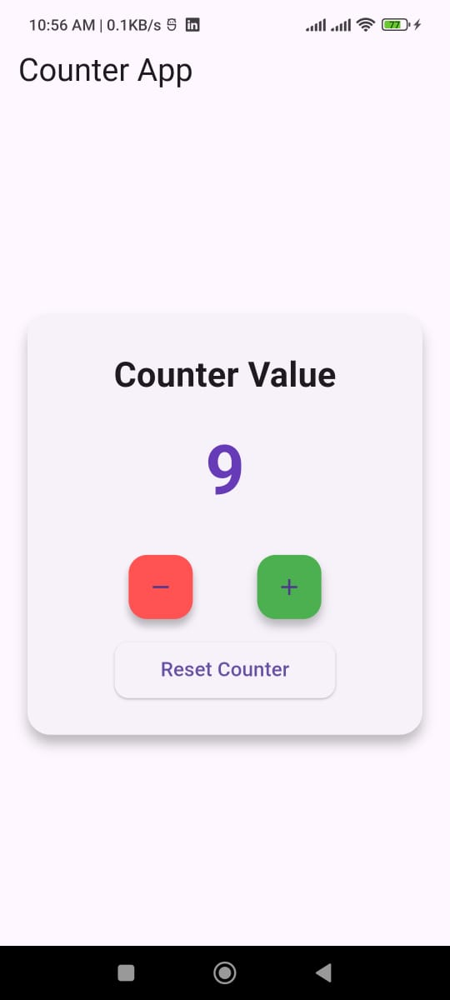

# Counter App 🚀

This is a simple **Flutter Counter App** created as part of my internship and practice tasks.  
The app demonstrates the use of **StatefulWidget** in Flutter and basic state management.

---

## 📱 Features
- Increment counter with a button  
- Display updated counter value in real-time  
- Clean and simple UI using Flutter Material Widgets  

---

## 🛠️ Technologies Used
- Flutter  
- Dart  
- Material Design  

📅 Internship Details
Internship: DevelopersHub Corporation
Week: 2
Task: Basic State Management with setState()

Author
Name: Suliman Khan
DHC : 16
Flutter Developer

